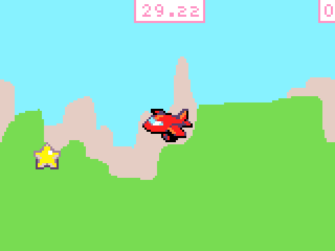
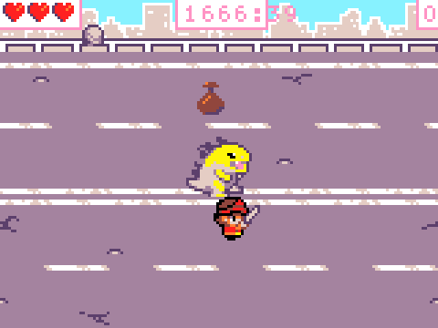
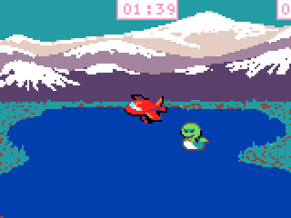
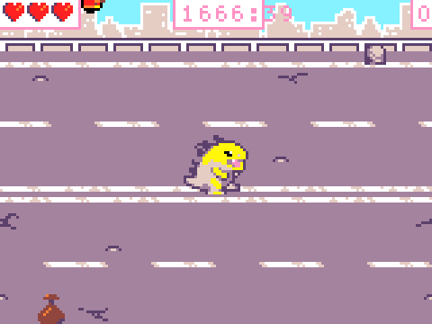
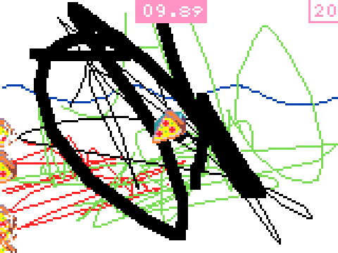

Hi, wir lernen hier Spiele programmieren bei [VHS StarnbergAmmersee](https://www.vhs-starnbergammersee.de/p/neu-im-programm/spiele-programmieren-mit-microsoft-arcade/fuer-kinder-ab-dem-4-schuljahr-665-C-252-6223-A).

Willst du mitmachen? Schaue [die nächsten Kurse](https://www.vhs-starnbergammersee.de/ueber-uns/unsere-kursleitungen/665-L-4048) an.

## Gallerie

Spielt gerne die Spiele, die unsere Schüler (8—12 Jahre Alt) programmiert haben.

  

   
   
<a href="https://arcade.makecode.com/S33836-98589-72654-15854">Code & Play</a>

  

  

   
   
<a href="https://makecode.com/_RHWPFUVdMi0h">Kilian</a>

  

  

   
   
<a href="https://makecode.com/_Edm6p0iYq9Ek">Ragnar</a>

  

  

   
   
<a href="https://makecode.com/_2kpYcXe080ov">Emil</a>

  

  

   
   
<a href="https://makecode.com/_b4Y0pchrwbPd">Maximilian</a>

  

## Für Teilnehmer

> [Programmierumgebung](https://arcade.microsoft.com) — hier arbeitest du Zuhause und in der Klasse.

### Beispiele und Übungen

### [Sammler #1](https://arcade.makecode.com/S33836-98589-72654-15854)

Lernziele:
 - Hintergrund
 - Sprite
 - Kontroller
 - Überlappungen

---
&copy; Roboteria, [Prochor Kammerzell](http://kmzl.de)
