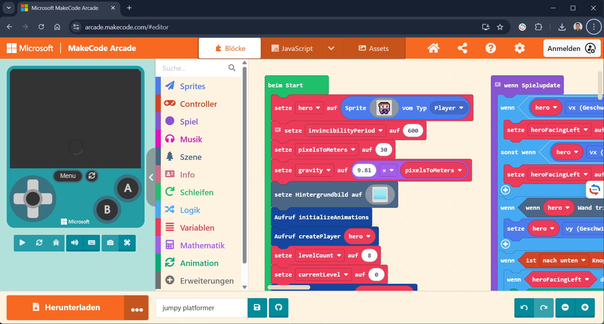
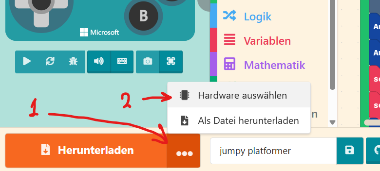
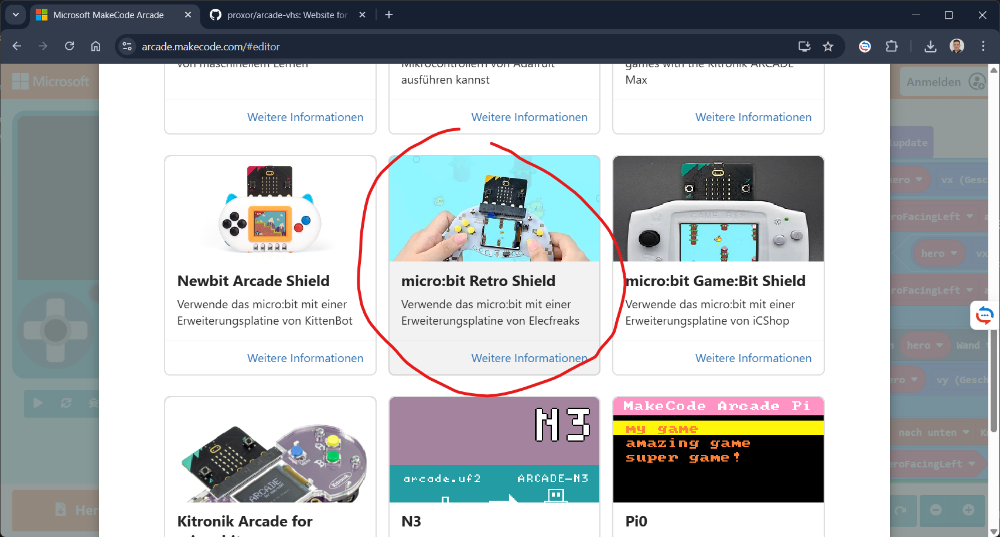
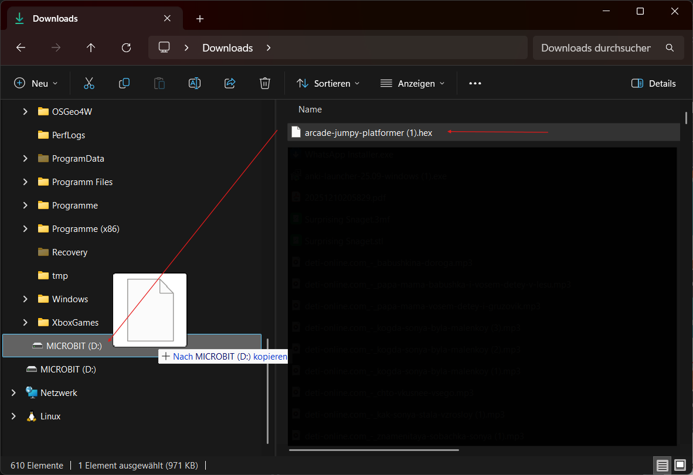

## Spiele aufs Retro Shield herunterladen

1. Das Spiel in [arcade.makecode.com](https://arcade.makecode.com) öffnen.

   

2. Drei-Punkte-Menü → **Hardware auswählen**.

   

3. **Retro Shield** finden und auswählen.

   

4. Auf **Herunterladen** klicken. Die Datei mit dem Programm wird im Browser heruntergeladen.

   

5. Den `micro:bit` mit dem USB-Kabel anschließen. Es öffnet sich ein Fenster mit dem Laufwerk.

6. Die Datei mit dem Programm im Ordner `Downloads` finden und auf das Laufwerk übertragen.

   

7. Wenn der Kopiervorgang abgeschlossen ist, das Kabel abkoppeln.

8. Batterien ins Retro Shield einsetzen.

9. Den `micro:bit` ins Retro Shield einstecken. Unten einschalten.

**Viel Spaß!**
